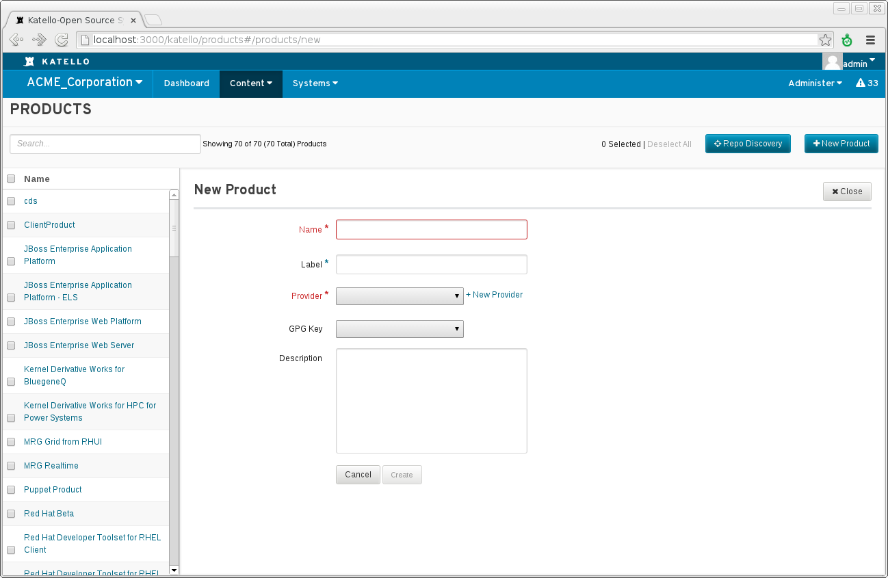
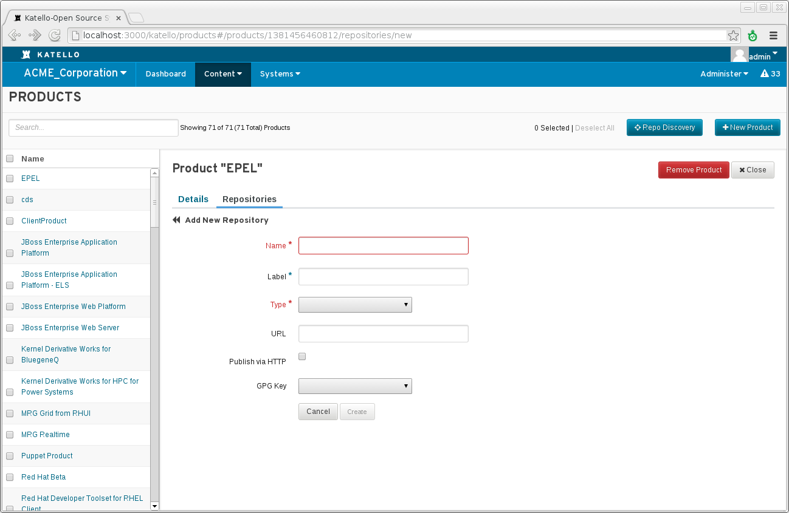
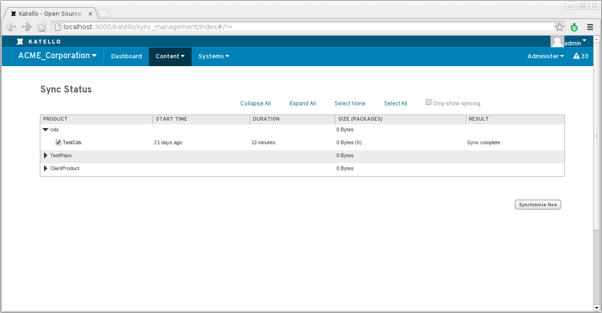
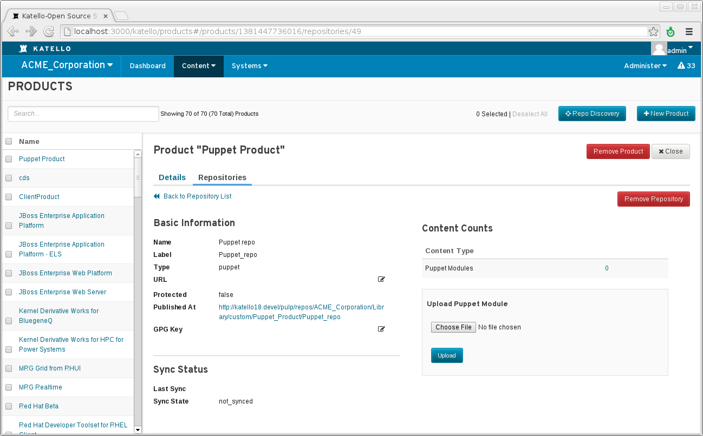

Content
=======

Katello can currently host two different types of content, rpms and puppet modules.
These can be synced from an external resource or can be uploaded directly. 

Definitions
-----------

* Repository - collection of content (either rpm or puppet)
* Product - Collection of repositories, systems subscribe to a product
* Provider - Collection of products mainly for organizational purposes (this may be removed in the future).
* Library - A special environment where repositories are created and content is synced or uploaded to.  A system can subscribe to library and recieve content as soon as it is synced or uploaded.


Creating a Product
------------------
From the web UI, navigate to:

Content > Repositories > Products > New Product (top right)




From the CLI:

```katello -u admin -p admin product create --org=ACME_Corporation --provider=MyProvider --name=EPEL```


Creating a Repository
---------------------
From the web UI, navigate to:

Content > Repositories > Products > Select desired product > Create Repository (right hand side)




From the CLI:

```katello repo  create  --org=ACME_Corporation --name="EPEL 6 x86_64" --product="EPEL" --url=http://dl.fedoraproject.org/pub/epel/6/x86_64/```

Syncing a Repository
--------------------
From the web UI naviagte to:

Content > Sync Management > Sync Status



From the CLI:

```katello repo synchronize --org=ACME_Corporation --name="EPEL 6 x86_64" --product="EPEL"```

Uploading Rpm Content
---------------------
A single rpm can be uploaded using the katello CLI:

```katello -u admin -p admin repo content_upload  --repo="repo name" --product="product name" --filepath=/path/to/package-1.0.0.x86_64.rpm  --content_type=yum --org=ACME_Corporation```

An entire directory can also be uploaded:

```katello -u admin -p admin repo content_upload  --repo="repo name" --product="product name" --filepath=/path/to/  --content_type=yum --org=ACME_Corporation```


Uploading puppet content
------------------------
Puppet modules can be uploaded using the katello CLI:

```katello -u admin -p admin repo content_upload  --repo="repo name" --product="product name" --filepath=/path/to/module.zip  --content_type=puppet --org=ACME_Corporation```

or via the web ui, navigate to:

Content > Repositories > Products > Select desired product > Select desired puppet Repository > Select file on the right



Subscribing a System to a Product
---------------------------------

Once a system is registered it can be subscribed to a product in a number of ways:

* via the web ui:

Systems -> Select desired system -> Subscriptions

Once subscriptions are attached you will need to run ```subscription-manager refresh``` in order for the client to use the associated repos.
This happens automatically every four hours.


  

 * via subscription manager on the client machine itself
  * locate the pool associated with the desired product:
  ```subscription-manager list --available --all```
  * subscribe to the specified pool:
  ```subscription-manager subscribe --pool-id=XXXXXX```


