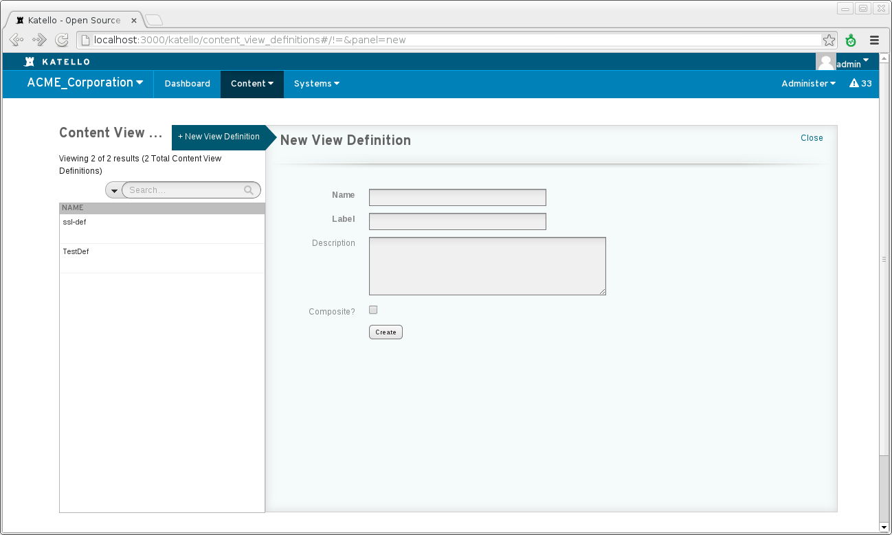
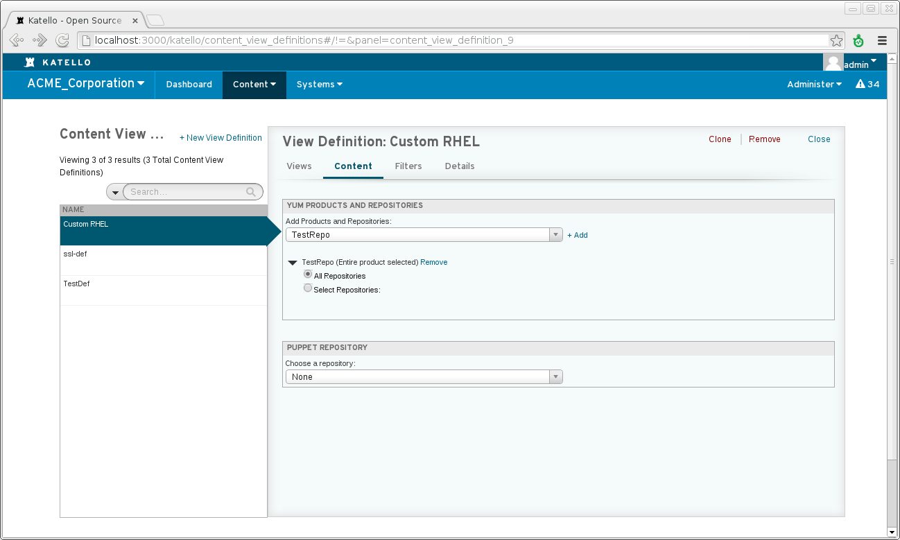

# Content Views #

What problems do a content view solve?
 * Allow you stage content through environments (Dev, Test, Production)
 * Allow you to filter the contents of a repository (remove a particular package, blacklist certain errata, etc..).
 * Allow you to have multiple snapshots of the same product or repository

## Definitions ##


 * Content View - snapshot of one or more repositories with or without filters applied
 * Content View Definition - a list of products/repositories and filters used for generating "Content Views"
 * Publishing - Content View Definitions are 'published' to a Content View.  Products and repositoires are cloned with filters applied.


## General Workflow ##

First create a product and repository in library and populating it with content (by syncing it or uploading content to it).
A system can now register directly to library and recieve that content.  Updates will be available as soon as new content is synced or uploaded.

To utilize content views for filtering and snapshoting:

1. Create a Content View Definition
2. Add the desired product/repository to the Content View Definition
3. Publish the definition to a Content View
4. Subscribe the system to the content view

At this point the system will no longer be getting content directly from Library, but from the content view. Updates to library will not affect this system.


# Content View Definition #

A content view definition is the 'recipe' for producing a content view.  
Entire or products or individual repositories are added along with filters that help define what packages and puppet content are included.

## Creating a Content View Definition ##

To Create a Content view Definition from the Web UI, Navigate to:

Content > Content View Definitions



From the cli:

```katello -u admin -p admin  content definition create --name="Custom RHEL" --org=ACME_Corporation```


## Adding a Product or Repository ##

Adding a product to a Content View Definition means whenever a Content View is published, all of the repositories contained within are included in the content view.
If a new repository is added to the product, it will automatically be included in the next publish or refresh without any addition effort.

Adding a repository within a product means that only that repository will be included within the Content View upon publishing or refreshing.

To add a product or repository from the web ui, navigate to:

Content > Content View Definitions > Select the desired content view definition > Content (within sub navigation)



From the cli, adding a product:

```
katello -u admin -p admin content definition add_product  --org=ACME_Corporation --name="Custom RHEL"
                                                          --product="Red Hat Enterprise Linux Server"
```

From the cli, adding a repository:

```
katello -u admin -p admin content definition add_repo  --org=ACME_Corporation --name="Custom RHEL"
                                                       --product="Red Hat Enterprise Linux Server"
                                                       --repo=""Red Hat Enterprise Linux 6 Server RPMs x86_64 6Server"
``` 

## Creating a filter ##

If you are just wanting to use content views as snapshots, filters are unecessary.  If, however, you want to filter what contents make it into the view, such as blacklisting a package by name or version, or blacklisting errata by date or type, filters can help accomplish these tasks.


## Publishing a Content View  ##


Subscribing a System
--------------------


Refreshing a content View
-------------------------


Promoting a Content View
------------------------


